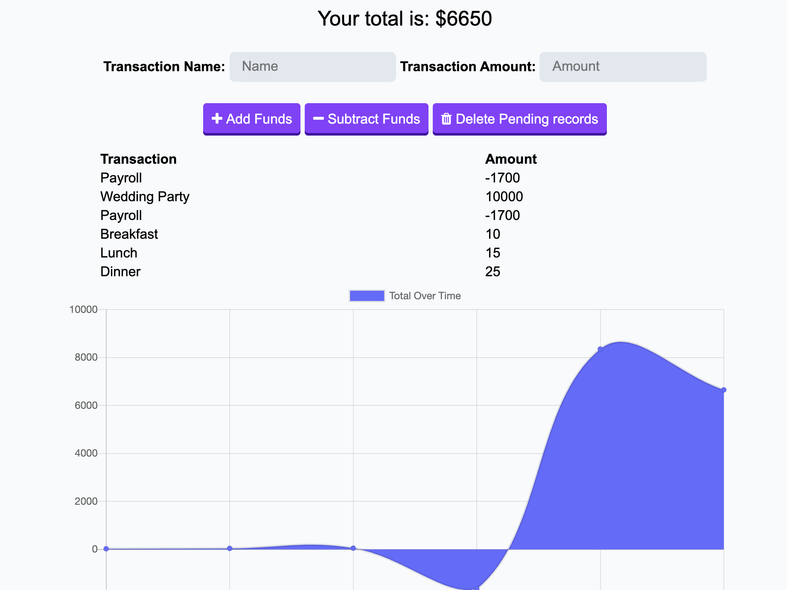

# pwa-budget-tracker

# Table of Contents (Optional)
N/A

# Installation

View Github Repository. https://github.com/alexahanthony/pwa-budget-tracker
View deployed link on Heroku. https://agile-caverns-71451.herokuapp.com/ 

# Usage

This commandline application allows you to keep track of expenses by adding and subtracting items and keeping track of the total remaining balance. There is a chart that shows the transaction history as well.

# Credits
There were no collaborators, (other than classmates and teacher feedback).

# NPM Packages: 
*  "express": "^4.16.4",
*  "mongoose": "^5.5.8"

# Third-party assets: 
https://getbootstrap.com/ for styling

https://stackoverflow.com/ for help with syntax

# License
N/A

# Badges
N/A

# Contributing
N/A

# Tests
N/A